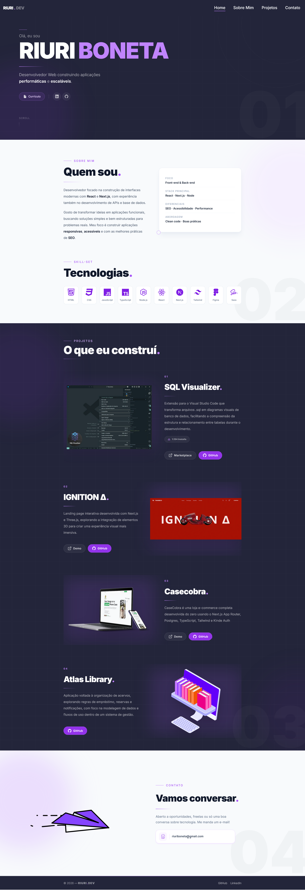

# 📊 Portfólio Pessoal

Um portfólio profissional moderno e responsivo construído com Next.js, apresentando projetos, habilidades e informações de contato com animações elegantes.

## 🎬 Prévia



## ✨ Características

- 🎨 **Design Moderno**: Interface limpa e profissional com Tailwind CSS
- ⚡ **Animações Suaves**: Animações com Framer Motion e Lottie React
- 📱 **Responsivo**: Totalmente otimizado para desktop, tablet e mobile
- ♿ **Acessível**: Desenvolvido com boas práticas de acessibilidade
- 📝 **SEO Friendly**: Otimizado para mecanismos de busca

## 🛠️ Stack Tecnológico

### Frontend
- **[Next.js](https://nextjs.org/)**  - Framework React com SSR
- **[React](https://react.dev/)**  - Biblioteca UI
- **[Tailwind CSS](https://tailwindcss.com/)**  - Utilitários CSS
- **[Framer Motion](https://www.framer.com/motion/)** - Animações avançadas
- **[Lottie React](https://www.npmjs.com/package/lottie-react)** - Animações JSON

### Ferramentas de Desenvolvimento
- **ESLint** - Linting de código
- **Prettier** - Formatação de código
- **PostCSS** - Transformação CSS
- **Autoprefixer** - Prefixos CSS automáticos

## 📋 Estrutura do Projeto

```
portifolio-pessoal/
├── public/
│   ├── images/               # Imagens e ícones
├── src/
│   ├── app/
│   │   ├── globals.css       # Estilos globais
│   │   ├── layout.jsx        # Layout raiz
│   │   ├── page.jsx          # Página inicial
│   │   └── not-found.jsx     # Página 404
│   ├── components/
│   │   ├── aboutSection/
│   │   │   └── AboutSection.jsx       # Seção sobre e habilidades
│   │   ├── contactSection/
│   │   │   └── ContactSection.jsx     # Seção de contato
│   │   ├── footer/
│   │   │   └── Footer.jsx             # Rodapé
│   │   ├── homeSection/
│   │   │   └── HomeSection.jsx        # Hero section
│   │   ├── navbar/
│   │   │   └── Navbar.jsx             # Navegação
│   │   ├── projectsSection/
│   │   │   ├── ProjectsSection.jsx    # Container de projetos
│   │   │   ├── Card.jsx               # Card individual do projeto
│   │   │   └── ActionButtons.jsx      # Botões de ação
│   │   ├── maxWidthWrapper/
│   │   │   └── MaxWidthWrapper.jsx    # Wrapper container
│   │   └── reveal/
│   │       └── Reveal.jsx             # Componente de animação
│   ├── hooks/
│   │   ├── useActiveSection.jsx       # Hook para seção ativa
│   │   └── useGetWidth.jsx            # Hook para detectar largura
│   ├── lib/
│   │   └── utils.js                   # Funções utilitárias
│   └── lottie/
│       └── plane.json                 # Animação Lottie
├── .eslintrc.json             # Configuração ESLint
├── .prettierrc                # Configuração Prettier
├── jsconfig.json              # Configuração JavaScript
├── next.config.mjs            # Configuração Next.js
├── postcss.config.mjs         # Configuração PostCSS
├── tailwind.config.js         # Configuração Tailwind CSS
├── package.json               # Dependências
├── package-lock.json          # Lock das dependências
├── LICENSE                    # Licença do projeto
└── README.md                  # Este arquivo
```

## 🚀 Como Começar

### Pré-requisitos
- Node.js 18+ 
- npm ou yarn

### Instalação

1. Clone o repositório:
```bash
git clone "https://github.com/RiuriII/portifolio-pessoal.git"
cd portifolio-pessoal
```

2. Instale as dependências:
```bash
npm install
```

3. Execute o servidor de desenvolvimento:
```bash
npm run dev
```

4. Abra [http://localhost:3000](http://localhost:3000) no seu navegador

## 📦 Scripts Disponíveis

- `npm run dev` - Inicia servidor de desenvolvimento
- `npm run build` - Constrói a aplicação para produção
- `npm start` - Inicia servidor de produção
- `npm run lint` - Executa ESLint


## 🎨 Customização

### Cores e Tema
Modifique o arquivo `tailwind.config.js` para personalizar as cores e temas.


### Animações
As animações usam Framer Motion e podem ser ajustadas nos componentes individuais. Veja a documentação do [Framer Motion](https://www.framer.com/motion/) para mais detalhes.


## 📚 Documentação

- [Next.js Documentation](https://nextjs.org/docs)
- [React Documentation](https://react.dev)
- [Tailwind CSS Documentation](https://tailwindcss.com/docs)
- [Framer Motion Documentation](https://www.framer.com/motion/)


## 📝 Licença

Este projeto está sob a licença MIT. Veja o arquivo [LICENSE](LICENSE) para mais detalhes.


